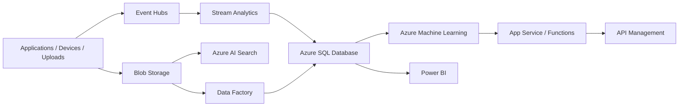

# azure

## Português

Este repositório foi organizado como um monorepo de portfólio para projetos orientados a **Microsoft Azure**, separando implementações demonstráveis de blueprints arquiteturais.

### Organização do monorepo

```text
azure/
├── projects/
│   ├── azure_streaming/
│   │   └── payment_anomaly_stream_azure/
│   ├── azure_search/
│   │   └── enterprise_policy_search_azure/
│   ├── azure_workflows/
│   │   └── claims_approval_workflow_azure/
│   └── azure_blueprints/
├── src/
├── tests/
└── main.py
```

### Projetos implementados

1. `payment_anomaly_stream_azure`
   Caso de uso orientado a eventos e streaming para monitoramento de pagamentos suspeitos.
2. `enterprise_policy_search_azure`
   Caso de uso de busca corporativa com foco em indexação e retrieval de políticas internas.
3. `claims_approval_workflow_azure`
   Caso de uso de workflow operacional para autoaprovação e fila de revisão manual.

### Blueprints adicionais

O repositório também inclui blueprints para:

- `loan-approval-mlops-azure`
- `document-lakehouse-azure`
- `customer-360-etl-azure`
- `risk-dashboard-webapp-azure`
- `financial-helpdesk-bot-azure`
- `product-defect-inspection-azure`

### Ferramentas Azure mapeadas

- `Azure Event Hubs`
- `Azure Stream Analytics`
- `Azure Machine Learning`
- `Azure AI Search`
- `App Service`
- `Azure SQL Database`
- `Logic Apps`
- `Azure Functions`
- `Blob Storage`
- `Azure Data Factory`
- `Azure Data Lake Storage`
- `Azure AI Bot Service`
- `Azure Custom Vision`
- `API Management`

### Arquitetura Azure de referência



### O que cada ferramenta faz

- `Event Hubs`
  Camada de ingestão de eventos em tempo real.
- `Stream Analytics`
  Processamento contínuo de sinais e regras sobre streams.
- `Azure Machine Learning`
  Treino, versionamento e operacionalização de modelos.
- `Azure AI Search`
  Indexação e recuperação de conteúdo corporativo.
- `App Service`
  Hospedagem de aplicações web e APIs.
- `Azure SQL Database`
  Armazenamento relacional gerenciado para workloads transacionais e analíticos leves.
- `Logic Apps`
  Orquestração low-code de integrações e fluxos operacionais.
- `Azure Functions`
  Execução serverless reativa para regras e automações.
- `Blob Storage`
  Armazenamento bruto de documentos e artefatos.
- `Azure Data Factory`
  ETL e integração entre fontes.
- `Azure Data Lake Storage`
  Camada de lakehouse e dados brutos em escala.
- `Azure AI Bot Service`
  Construção de bots integrados com canais e serviços cognitivos.
- `Azure Custom Vision`
  Modelagem visual para classificação ou detecção de defeitos.
- `API Management`
  Governança, segurança e exposição de APIs.

### Execução

```bash
python3 main.py
python3 -m unittest discover -s tests -v
python3 -m py_compile main.py src/projects.py \
  projects/azure_streaming/payment_anomaly_stream_azure/project.py \
  projects/azure_search/enterprise_policy_search_azure/project.py \
  projects/azure_workflows/claims_approval_workflow_azure/project.py
```

### Artefato gerado

- `data/processed/azure_portfolio_report.json`

Esse arquivo é gerado em runtime e não é versionado.

### Referência oficial

- [Azure products](https://azure.microsoft.com/en-us/products)

---

## English

This repository is organized as an Azure-focused portfolio monorepo, separating implemented demo projects from architectural blueprints.

### Implemented projects

- `payment_anomaly_stream_azure`
- `enterprise_policy_search_azure`
- `claims_approval_workflow_azure`

### Additional blueprints

- `loan-approval-mlops-azure`
- `document-lakehouse-azure`
- `customer-360-etl-azure`
- `risk-dashboard-webapp-azure`
- `financial-helpdesk-bot-azure`
- `product-defect-inspection-azure`

### Core Azure services covered

- `Azure Event Hubs`
- `Azure Stream Analytics`
- `Azure Machine Learning`
- `Azure AI Search`
- `App Service`
- `Azure SQL Database`
- `Logic Apps`
- `Azure Functions`
- `Blob Storage`
- `Azure Data Factory`
- `Azure Data Lake Storage`
- `Azure AI Bot Service`
- `Azure Custom Vision`
- `API Management`
