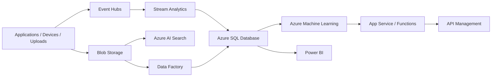

# azure

## Português

Este repositório foi organizado como um monorepo de portfólio para projetos orientados a **Microsoft Azure**, separando implementações demonstráveis de blueprints arquiteturais.

### Organização do monorepo

```text
azure/
├── projects/
│   ├── azure_streaming/
│   │   └── payment_anomaly_stream_azure/
│   ├── azure_search/
│   │   └── enterprise_policy_search_azure/
│   ├── azure_workflows/
│   │   └── claims_approval_workflow_azure/
│   └── azure_blueprints/
├── src/
├── tests/
└── main.py
```

### Projetos implementados

1. `payment_anomaly_stream_azure`
   Caso de uso orientado a eventos e streaming para monitoramento de pagamentos suspeitos.
2. `enterprise_policy_search_azure`
   Caso de uso de busca corporativa com foco em indexação e retrieval de políticas internas.
3. `claims_approval_workflow_azure`
   Caso de uso de workflow operacional para autoaprovação e fila de revisão manual.

### Blueprints adicionais

O repositório também inclui blueprints para:

- `loan-approval-mlops-azure`
- `document-lakehouse-azure`
- `customer-360-etl-azure`
- `risk-dashboard-webapp-azure`
- `financial-helpdesk-bot-azure`
- `product-defect-inspection-azure`

### Ferramentas Azure mapeadas

- `Azure Event Hubs`
- `Azure Stream Analytics`
- `Azure Machine Learning`
- `Azure AI Search`
- `App Service`
- `Azure SQL Database`
- `Logic Apps`
- `Azure Functions`
- `Blob Storage`
- `Azure Data Factory`
- `Azure Data Lake Storage`
- `Azure AI Bot Service`
- `Azure Custom Vision`
- `API Management`

### Arquitetura Azure de referência



### O que cada ferramenta faz

- `Event Hubs`
  É o serviço de streaming de eventos da Azure.
  Serve para ingerir telemetria, transações, logs e sinais em tempo real em alto volume.
- `Stream Analytics`
  É o motor de processamento contínuo de streams da Azure.
  Serve para aplicar regras, agregações, janelas temporais e detecção operacional em eventos que chegam continuamente.
- `Azure Machine Learning`
  É a plataforma gerenciada de machine learning da Azure.
  Serve para treino, versionamento, registry, deployment e monitoramento de modelos.
- `Azure AI Search`
  É o serviço de busca e indexação corporativa da Azure.
  Serve para indexar documentos, FAQs, políticas e bases internas, permitindo retrieval textual e semântico.
- `App Service`
  É a plataforma gerenciada para hospedar aplicações web.
  Serve para publicar frontends, backends e APIs com operação simplificada.
- `Azure SQL Database`
  É o banco relacional gerenciado da Azure.
  Serve para armazenar dados estruturados em aplicações transacionais e em workloads analíticos menores.
- `Logic Apps`
  É a ferramenta de orquestração low-code/no-code da Azure.
  Serve para montar workflows de integração, aprovação e automação entre sistemas.
- `Azure Functions`
  É o serviço serverless baseado em funções.
  Serve para executar lógica sob demanda em resposta a eventos, timers, filas e triggers HTTP.
- `Blob Storage`
  É a camada de object storage da Azure.
  Serve para guardar arquivos, documentos, imagens, modelos e artefatos brutos.
- `Azure Data Factory`
  É o serviço de integração e orquestração de dados da Azure.
  Serve para ETL/ELT, movimentação de dados e integração entre fontes distintas.
- `Azure Data Lake Storage`
  É a camada de armazenamento analítico em escala da Azure.
  Serve para organizar dados brutos e curados em arquitetura de data lake ou lakehouse.
- `Azure AI Bot Service`
  É o serviço de construção e operação de bots conversacionais da Azure.
  Serve para conectar bots a canais, fluxos conversacionais e serviços cognitivos.
- `Azure Custom Vision`
  É um serviço de visão computacional customizável da Azure.
  Serve para treinar classificadores e detectores visuais voltados a imagens específicas do negócio.
- `API Management`
  É a camada de governança de APIs da Azure.
  Serve para publicar APIs com autenticação, rate limit, versionamento, documentação e controle de consumo.

### Como ler essa arquitetura

Em termos de camadas, o desenho pode ser entendido assim:

- `ingestão`
  `Event Hubs` e `Blob Storage`
- `processamento e integração`
  `Stream Analytics`, `Logic Apps`, `Azure Functions` e `Azure Data Factory`
- `armazenamento e consulta`
  `Azure SQL Database` e `Azure Data Lake Storage`
- `IA e busca`
  `Azure Machine Learning`, `Azure AI Search`, `Azure AI Bot Service` e `Azure Custom Vision`
- `exposição e consumo`
  `App Service`, `API Management` e `Power BI`

### Execução

```bash
python3 main.py
python3 -m unittest discover -s tests -v
python3 -m py_compile main.py src/projects.py \
  projects/azure_streaming/payment_anomaly_stream_azure/project.py \
  projects/azure_search/enterprise_policy_search_azure/project.py \
  projects/azure_workflows/claims_approval_workflow_azure/project.py
```

### Artefato gerado

- `data/processed/azure_portfolio_report.json`

Esse arquivo é gerado em runtime e não é versionado.

### Referência oficial

- [Azure products](https://azure.microsoft.com/en-us/products)

---

## English

This repository is organized as an Azure-focused portfolio monorepo, separating implemented demo projects from architectural blueprints.

### Implemented projects

- `payment_anomaly_stream_azure`
- `enterprise_policy_search_azure`
- `claims_approval_workflow_azure`

### Additional blueprints

- `loan-approval-mlops-azure`
- `document-lakehouse-azure`
- `customer-360-etl-azure`
- `risk-dashboard-webapp-azure`
- `financial-helpdesk-bot-azure`
- `product-defect-inspection-azure`

### Core Azure services covered

- `Azure Event Hubs`
- `Azure Stream Analytics`
- `Azure Machine Learning`
- `Azure AI Search`
- `App Service`
- `Azure SQL Database`
- `Logic Apps`
- `Azure Functions`
- `Blob Storage`
- `Azure Data Factory`
- `Azure Data Lake Storage`
- `Azure AI Bot Service`
- `Azure Custom Vision`
- `API Management`

### What each Azure service is used for

- `Azure Event Hubs`
  Azure event streaming service.
  Used for high-volume ingestion of transactions, telemetry, and operational events.
- `Azure Stream Analytics`
  Azure stream processing engine.
  Used for continuous rules, aggregations, windowing, and near-real-time event analytics.
- `Azure Machine Learning`
  Azure managed ML platform.
  Used for training, registry, deployment, and operationalization of ML models.
- `Azure AI Search`
  Azure enterprise search and indexing layer.
  Used for document indexing, retrieval, and knowledge search workloads.
- `App Service`
  Azure managed web application hosting platform.
  Used to expose web apps, backends, and lightweight APIs.
- `Azure SQL Database`
  Azure managed relational database.
  Used for structured transactional storage and smaller analytical workloads.
- `Logic Apps`
  Azure workflow orchestration service.
  Used to automate integrations and approval-style business processes.
- `Azure Functions`
  Azure serverless execution model.
  Used for event-driven automation and lightweight backend logic.
- `Blob Storage`
  Azure object storage layer.
  Used for raw files, images, documents, and model artifacts.
- `Azure Data Factory`
  Azure data integration and orchestration platform.
  Used for ETL/ELT pipelines and source-to-source data movement.
- `Azure Data Lake Storage`
  Azure scalable analytical storage layer.
  Used for lakehouse-style raw and curated data zones.
- `Azure AI Bot Service`
  Azure bot-building service.
  Used for conversational assistants integrated with channels and enterprise workflows.
- `Azure Custom Vision`
  Azure custom computer vision service.
  Used for image classification and defect inspection scenarios.
- `API Management`
  Azure API governance layer.
  Used for secure publishing, throttling, versioning, and lifecycle control of APIs.

### How to read this architecture

The reference design can be interpreted in layers:

- `ingestion`
  `Event Hubs` and `Blob Storage`
- `processing and orchestration`
  `Stream Analytics`, `Logic Apps`, `Azure Functions`, and `Azure Data Factory`
- `storage and query`
  `Azure SQL Database` and `Azure Data Lake Storage`
- `AI and search`
  `Azure Machine Learning`, `Azure AI Search`, `Azure AI Bot Service`, and `Azure Custom Vision`
- `exposure and consumption`
  `App Service`, `API Management`, and `Power BI`
